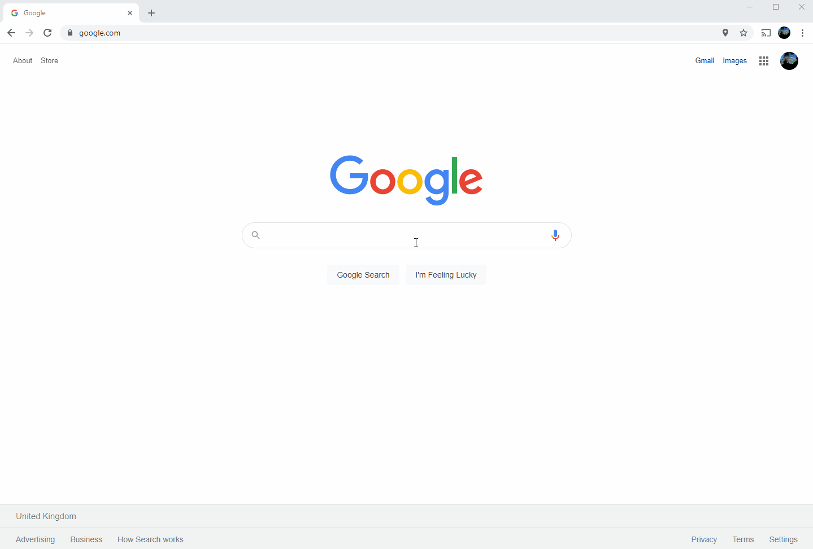

# GitHub Repo README.md Dead Link Finder

## Why was this Repo created...

Many GitHub Repos have “README” files that contain bad links. 

The owners and contributors to these Repos are often unaware and this is not the easiest thing to check.

This Repo contains a set of applications that will search for Repos that have README files which contain bad links.

If you have reached this Repo page because a bad link has been found in one of your repo's README files then please consider giving this Repo a Star or suggesting an improvement by logging an Issue.

## Web UI

Access the Web UI via this link: https://GitHubReadMeChecker.com

Want to include Forkes Repos? Then add the "&IncludeForks=true" into the url

## Console UI

This tool can also run as a batch console application (it finds a Repo with a bad link in it's README.md after about 30 seconds)...

Currently this program searches all of GitHub for Repos with over 100 Stars that have had a commit within the last hour.

A (user changeable) default of 25 repos are checked per run of the program.

Once a bad link is found the relevant information saved in a file.

Then this information can be manually passed on, likely by creating an Issue in the affected Repo (which is probably why you might have ended up here reading this).

The GitHub API has a Rate Limit to throttle the amount of request from a certain source: https://developer.github.com/v3/rate_limit/

To increase this limit when using this program you can enter your Personal Access Token: https://github.com/settings/tokens

However this is optional and the program will still work without this although this limit may get hit.
